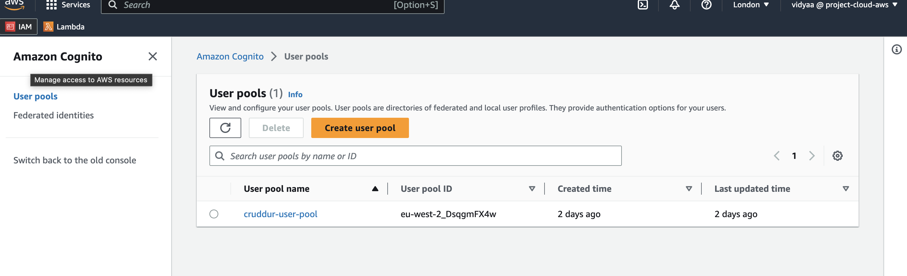

# Week 3 — Decentralized Authentication

### [Setup Cognito User Pool](setup-cognito-user-pool)
### [Implement SignIn & SignUp Page](implement-signin-&-signup-page)
### [Implement Custom Confirmation & Recovery Page](implement-custom-confirmation-&-recovery-page)
### [Different approaches to verifying JWTs](different-approaches-to-verifying-jwts)
### [Amazon Cognito Security Best Practices](amazon-cognito-security-best-practices)
### Amazon Cognito Security Best Practices
### Setup Cognito User Pool
Provision and setup AWS Cognito via Click-Ops. Needs a valid AWS Account. 



### Implement SignIn & SignUp Page

1. To connect AWS Cognito to the frontend application we need to add AWS Amplify. In command line
```sh
npm i aws-amplify --save
```
2. Include the above package  in gitpod.yml
```sh
aws-amplify
```
3. Retreieve Userpool ID and Client ID from the console or CLI
4. Add the follwing env var to docker compose file
```sh
frontend-react-js:
    environment:
      REACT_APP_BACKEND_URL: "https://4567-${GITPOD_WORKSPACE_ID}.${GITPOD_WORKSPACE_CLUSTER_HOST}"
      REACT_APP_PROJECT_REGION: "${AWS_DEFAULT_REGION}"
      REACT_APP_AWS_COGNITO_REGION: "${AWS_DEFAULT_REGION}"
      REACT_APP_AWS_USER_POOLS_ID: "${AWS_USER_POOLS_ID}"
      REACT_APP_CLIENT_ID: "${COGNITO_APP_CLIENT_ID}"
```
5. Add the following to app.js file
```sh
import { Amplify } from 'aws-amplify';


Amplify.configure({
  "AWS_PROJECT_REGION": process.env.REACT_APP_AWS_PROJECT_REGION,
  "aws_cognito_identity_pool_id": process.env.REACT_APP_AWS_COGNITO_IDENTITY_POOL_ID,
  "aws_cognito_region": process.env.REACT_APP_AWS_COGNITO_REGION,
  "aws_user_pools_id": process.env.REACT_APP_AWS_USER_POOLS_ID,
  "aws_user_pools_web_client_id": process.env.REACT_APP_CLIENT_ID,
  "oauth": {},
  Auth: {
    // We are not using an Identity Pool
    // identityPoolId: process.env.REACT_APP_IDENTITY_POOL_ID, // REQUIRED - Amazon Cognito Identity Pool ID
    region: process.env.REACT_APP_AWS_PROJECT_REGION,           // REQUIRED - Amazon Cognito Region
    userPoolId: process.env.REACT_APP_AWS_USER_POOLS_ID,         // OPTIONAL - Amazon Cognito User Pool ID
    userPoolWebClientId: process.env.REACT_APP_CLIENT_ID,   // OPTIONAL - Amazon Cognito Web Client ID (26-char alphanumeric string)
  }
});

```
6. Change the homefeed page  to add customisations
```sh
import { Auth } from 'aws-amplify';
import DesktopNavigation from '../components/Desktopnavigation';
import DesktopSidebar from '../components/DesktopSidebar';
```

7. Add the following to checkAuth in the same file
```sh
const checkAuth = async () => {
    Auth.currentAuthenticatedUser({
      // Optional, By default is false. 
      // If set to true, this call will send a 
      // request to Cognito to get the latest user data
      bypassCache: false 
    })
    .then((user) => {
      console.log('user',user);
      return Auth.currentAuthenticatedUser()
    }).then((cognito_user) => {
        setUser({
          display_name: cognito_user.attributes.name,
          handle: cognito_user.attributes.preferred_username
        })
    })
    .catch((err) => console.log(err));
  };
  
```
8. To enable username sign in add the follwing in SigninPage.js
```sh
import { Auth } from 'aws-amplify';
```

```sh
const onsubmit = async (event) => {
    setErrors('')
    console.log()
    event.preventDefault();
    Auth.signIn(email, password)
    .then(user => {
      localStorage.setItem("access_token", user.signInUserSession.accessToken.jwtToken)
      window.location.href = "/"
    })
    .catch (error => {
      if (error.code == 'UserNotConfirmedException') {
        window.location.href = "/confirm"
      }
      setErrors(error.message)
    });
    return false
  }
```

9. change the profileinfo.js as follows
```sh
 const signOut = async () => {
    try {
        await Auth.signOut({ global: true });
        window.location.href = "/"
    } catch (error) {
        console.log('error signing out: ', error);
    }
  }
```

10. Create a user in userpool and set a password by admin using the following code
```sh
aws cognito-idp admin-set-user-password \
  --user-pool-id <your-user-pool-id> \
  --username <username> \
  --password <password> \
  --permanent
```

### Implement Custom Confirmation & Recovery Page

1. In SignUp page.js add the  following code

```sh

const onsubmit = async (event) => {
  event.preventDefault();
  setCognitoErrors('')
  try {
      const { user } = await Auth.signUp({
        username: email,
        password: password,
        attributes: {
            name: name,
            email: email,
            preferred_username: username,
        },
        autoSignIn: { // optional - enables auto sign in after user is confirmed
            enabled: true,
        }
      });
      console.log(user);
      window.location.href = `/confirm?email=${email}`
  } catch (error) {
      console.log(error);
      setCognitoErrors(error.message)
  }
  return false
}
```

2. In confirmationpage.js add the following code
```sh
const resend_code = async (event) => {
  setErrors('')
  try {
    await Auth.resendSignUp(email);
    console.log('code resent successfully');
    setCodeSent(true)
  } catch (err) {
    // does not return a code
    // does cognito always return english
    // for this to be an okay match?
    console.log(err)
    if (err.message == 'Username cannot be empty'){
      setErrors("You need to provide an email in order to send Resend Activiation Code")   
    } else if (err.message == "Username/client id combination not found."){
      setErrors("Email is invalid or cannot be found.")   
    }
  }
}
```

```sh
 const onsubmit = async (event) => {
  event.preventDefault();
  setErrors('')
  try {
    await Auth.confirmSignUp(email, code);
    window.location.href = "/"
  } catch (error) {
    setErrors(error.message)
  }
  return false
}
```

3. In recoverpage.js

import Auth library

```sh
const onsubmit_send_code = async (event) => {
  event.preventDefault();
  setErrors('')
  Auth.forgotPassword(username)
  .then((data) => setFormState('confirm_code') )
  .catch((err) => setErrors(err.message) );
  return false
  }
```

```sh
const onsubmit_confirm_code = async (event) => {
  event.preventDefault();
  setErrors('')
  if (password == passwordAgain){
    Auth.forgotPasswordSubmit(username, code, password)
    .then((data) => setFormState('success'))
    .catch((err) => setCognitoErrors(err.message) );
  } else {
    setErrors('Passwords do not match')
  }
  return false
  }
 ```
 
 4. Check by creating new user and recovering password.
 


### Amazon Cognito Security Best Practices
#### Client side Applications
  - Traditional Authentication (Credentials)
      - username & password
      - physical access card

  - Single Sign ON/SAML (Security Assertion markup Language)
  - OAuth
  - OpenID - social credentials to authenticate (dont nedd to create a new account), Only Authentication no Authorization
  - Authorisation will be provided by OAuth2.0
  - OpenID & OAuth together
 
 #### Decentralized Authentication
  - Store username & password in one location and authorize all applications from this one location
  - dont need to use different username and password between different applications
  -
 #### Amazon Cognito
  - user directory with context of amazon services
  - UserPools (Add user directories to your app)
      - Cognito User pools
      - Federated Identities
  - IdentityPools (Grant access to AWS Services)

#### User Lifecycle Management
  - user identity
  - New employee - Provision (Azure directrory, Amazon direcrtory) - Enforced policies - Update policies - Offboard 
  - Regularly update and review user policies

#### Token Lifecycle Management
